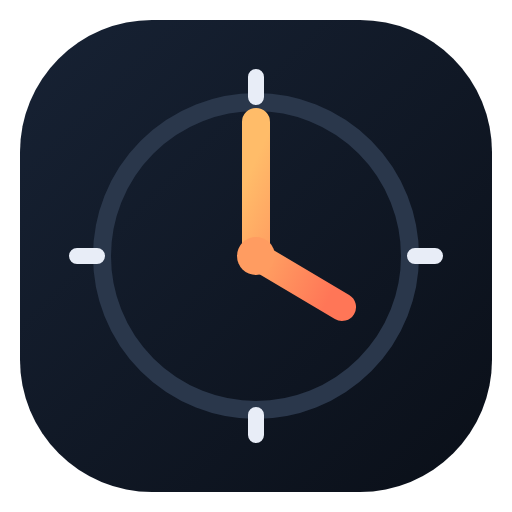
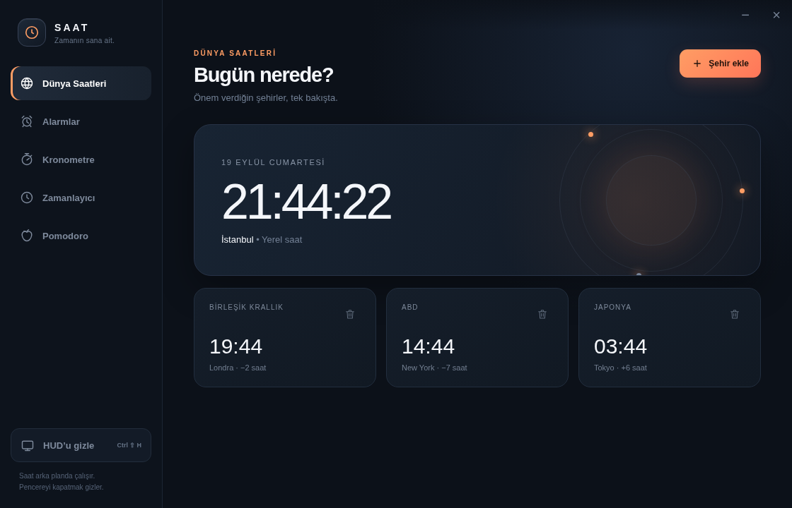
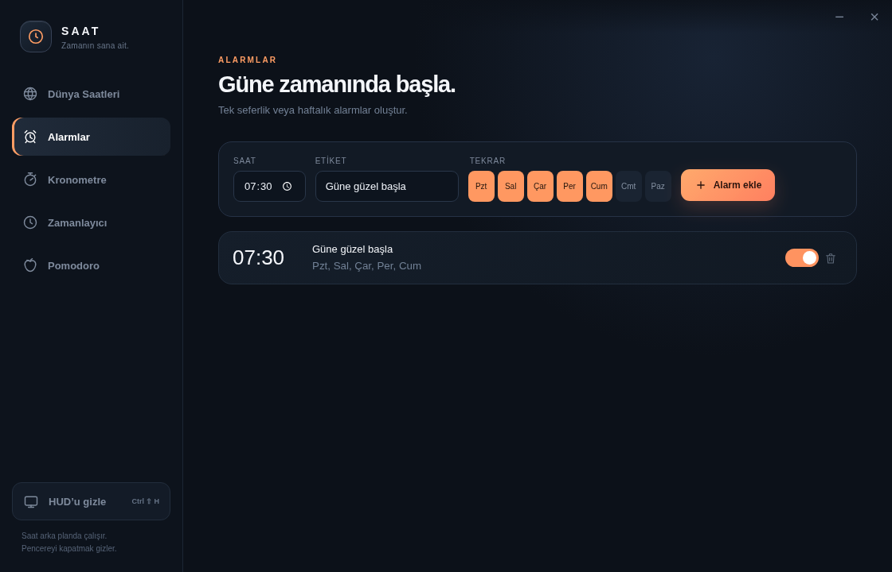
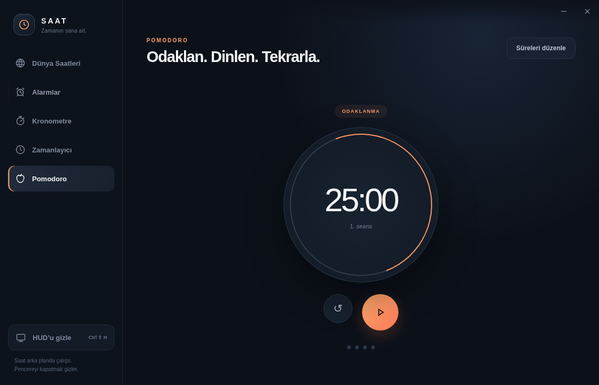
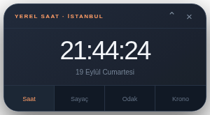

<div align="center">
  
  <h1>Saat</h1>
  <p>Dünya saatleri, alarm, kronometre, zamanlayıcı ve Pomodoro'yu<br>zarif bir masaüstü deneyiminde buluşturan açık kaynak saat uygulaması.</p>

  [](https://www.electronjs.org/)
  [](#kurulum)
  [](#testler)
  [](LICENSE)
</div>



## Özellikler

- **Dünya saatleri:** İstanbul, Londra, New York, Tokyo ve eklediğin diğer şehirleri tek bakışta gör.
- **Alarmlar:** Tek seferlik veya haftanın belirli günlerinde tekrarlanan alarmlar oluştur; gerektiğinde 5 dakika ertele.
- **Kronometre:** Monotonik zaman ölçümüyle hassas süre ve tur kayıtları al.
- **Çoklu zamanlayıcı:** Yemek, egzersiz veya günlük işler için birden fazla sayacı aynı anda çalıştır.
- **Pomodoro:** Ayarlanabilir odaklanma, kısa mola ve uzun mola döngüleriyle çalışma ritmini koru.
- **Bağımsız HUD:** Saat veya aktif sayacı diğer pencerelerin üzerinde, sürüklenebilir küçük bir panelde izle.
- **Arka planda çalışma:** Ana pencere gizlendiğinde alarmlar ve sayaçlar sistem tepsisinde çalışmayı sürdürür.
- **Kalıcı durum:** Şehirler, alarmlar, sayaçlar ve HUD konumu otomatik olarak kaydedilir.

## Görünümler

<table>
  <tr>
    <td width="50%"></td>
    <td width="50%"></td>
  </tr>
  <tr>
    <td align="center"><strong>Tekrarlı alarmlar</strong></td>
    <td align="center"><strong>Pomodoro çalışma döngüsü</strong></td>
  </tr>
</table>

### Her zaman görünür HUD

HUD; yerel saat, zamanlayıcı, Pomodoro ve kronometre arasında geçiş yapar. `Ctrl+Shift+H` kısayoluyla anında gösterilip gizlenebilir.

<p align="center"></p>

## Kurulum

Gereksinimler: Linux masaüstü, Node.js 20 veya üzeri ve npm.

```bash
git clone https://github.com/kadircicek34/saat-hud.git
cd saat-hud
npm ci
./install-desktop.sh
```

Kurulum tamamlandığında uygulama menüsünde ve masaüstünde **Saat** ikonu görünür. Kurulum yapmadan çalıştırmak için:

```bash
npm start
```

> Root kullanıcıyla çalışan geliştirme ortamlarında Chromium sandbox kısıtı nedeniyle `./launch-saat` betiğini kullanın. Normal masaüstü kullanıcılarında sandbox varsayılan olarak açıktır.

## Kullanım

Ana pencerenin sol menüsünden özelliği seçebilirsin. Pencerenin kapatma düğmesi uygulamayı sonlandırmak yerine sistem tepsisine gizler. Tamamen kapatmak için tepsi menüsündeki **Uygulamadan çık** seçeneğini kullan.

HUD üzerindeki sekmeler:

| Sekme | Gösterilen bilgi |
| --- | --- |
| Saat | İstanbul saati ve tarih |
| Sayaç | Çalışan ilk zamanlayıcı |
| Odak | Pomodoro aşaması ve kalan süre |
| Krono | Kronometrede geçen süre |

## Testler

Zaman hesapları ve uygulamanın gerçek Electron pencereleri otomatik testlerle doğrulanır.

```bash
npm test
npm run test:ui
```

Test paketi; alarm tekrarlarını, zamanlayıcı duraklatma/devam davranışını, monotonik kronometreyi, Pomodoro geçişlerini ve ana pencere ile HUD arasındaki etkileşimi kapsar.

## Teknik yapı

- Electron ana süreci pencere, sistem tepsisi, bildirim ve kalıcı durum yönetimini üstlenir.
- Arayüz saf HTML, CSS ve JavaScript ile hazırlanmıştır; uzak içerik yüklemez.
- Renderer süreçleri bağlam izolasyonu ve sandbox ile çalışır.
- Saat dilimleri yerleşik `Intl.DateTimeFormat` üzerinden hesaplanır; yaz/kış saati değişimleri otomatik uygulanır.

## Katkı

Hata bildirimi ve geliştirme önerileri için issue açabilir, değişiklikler için pull request gönderebilirsin.

## Lisans

Bu proje [MIT Lisansı](LICENSE) ile yayımlanmıştır.
